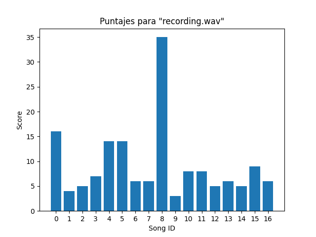

# Introduction

As its name says, this program can identify a song (assuming it is within the database) when given a short fragment of it, written completely in Python and its libraries (available through pip). Thanks to a score-based algorithm, there is no need for a noise-reduction filter to aid with the FFT fingerprinting process, as long as there is a sensible signal-to-nosie ratio. This allows the program to effectively identify a song within the pool even if the output quality from the source or the recording device quality is not optimal. This, however, requires a reasonable database size (an adequate size has been around 30 sound files).

Keep in mind that, given the nature of the programming language used, the time taken to create the databases from a song library may be exhaustively long and resource-consuming. An optimization of this project is still a work in progress.

Testing was performed in Fedora 34 and openSUSE Leap 15.3 with pipewire and pulseaudio. Current version requires folders `music_data/database_peaks/` and `music_data/database_audio` to exist inside the main project. Music files (preferably `.wav` format) should be placed inside the latter location.

# Dependencies (Python 3)

* `librosa`
* `matplotlib`
* `numpy`
* `pyaudio`
  * requires `python3-devel` or similar, `portaudio-devel`, `alsa-lib-devel`, and probably `portaudio` (unfortunately)
* `scipy`

# Screenshot of an actual test

  

> Example of a correctly identified recording and its respective song ID (corresponding to the highest score) inside the database.
